# 简易英英词典 — 汇编课程设计

基于 8086 汇编语言实现的英英词典，支持单词的增删改查、模糊搜索、同/反义词查询，以及文件导入导出。

## 快速开始

1. 安装 [emu8086](https://emu8086-microprocessor-emulator.en.softonic.com/) 模拟器
2. 在 emu8086 虚拟磁盘的 `d:\` 目录下创建 `words.txt` 文件（或取消代码中 import 部分的注释以使用内置数据）
3. 用 emu8086 打开 `mycode.asm`，点击 **emulate** → **run** 即可运行
4. 通过键盘输入 0–4 选择功能，按提示操作

## 开发环境

- Windows 10 (x64)
- emu8086

## 功能概览

| 功能 | 说明 |
|------|------|
| 导入/导出 | 从文件加载单词数据，退出时写回文件 |
| 精确查找 | 查询单词的英文解释、同义词、反义词 |
| 模糊查找 | 输入前缀，列出所有匹配的单词（如 `en` → `enable, enabled, enact`） |
| 插入 | 按字典序插入新单词及其解释、同/反义词 |
| 修改 | 修改已有单词的解释信息 |
| 删除 | 删除单词及其所有信息 |

## 使用前配置

代码默认从 `d:\words.txt` 导入数据（**注意：此处 d 盘是 emu8086 虚拟磁盘**），请提前在对应目录创建好文件。

也可以**将代码主程序 import 部分中的注释块取消注释**，使用内置数据：

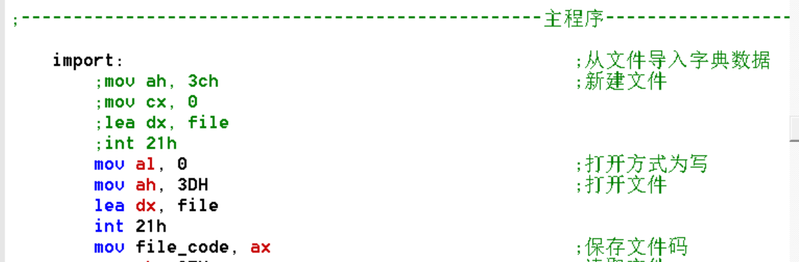

## 注意事项

1. **请在光标跳动时进行输入**，否则输入会进入缓冲区，在后续操作中被自动消费，导致意外行为。误输入时可点击清空缓冲区：
2. **输入前请切换至英文输入法**，中文输入会导致数据出错或乱码。
3. 搜索/插入/修改/删除等操作需要遍历查找，**耗时较长，请耐心等待光标再次跳动**后再继续操作。

## 功能展示

### 1. 单词导入

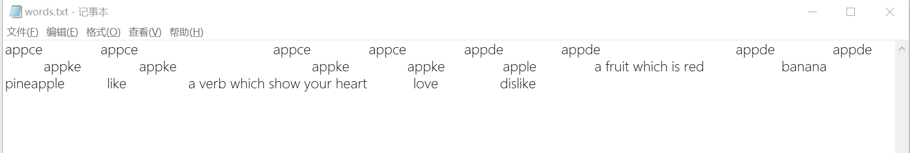

### 2. 单词查找

**精确查找**

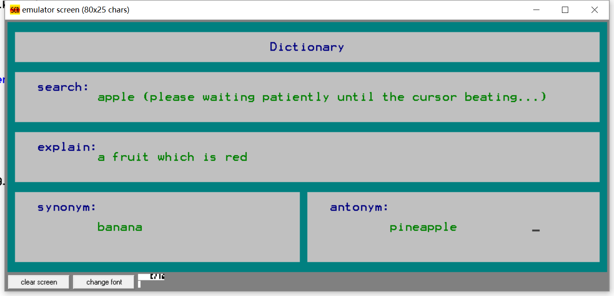

**模糊查找**

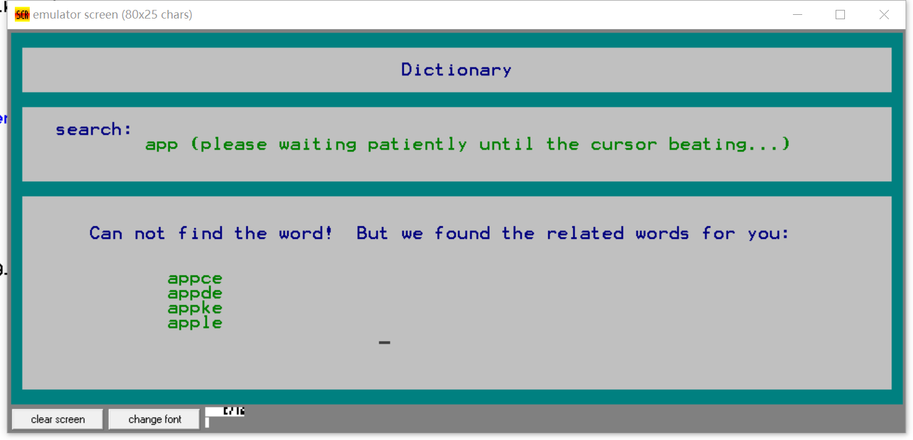

**查找不存在的单词**

### 3. 单词插入

**插入已存在的单词（提示重复）**

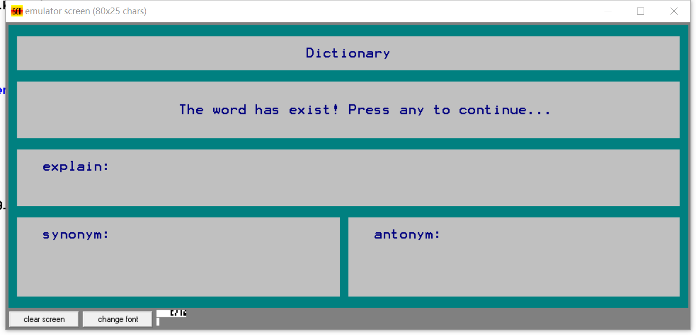

**插入新单词**

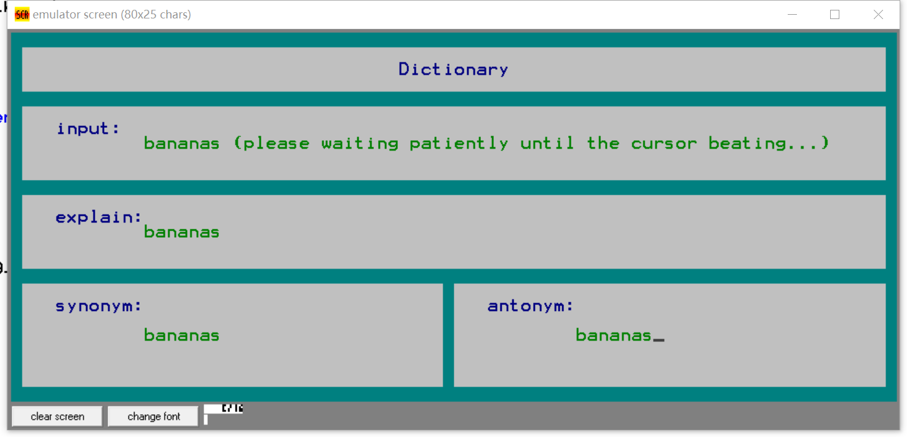
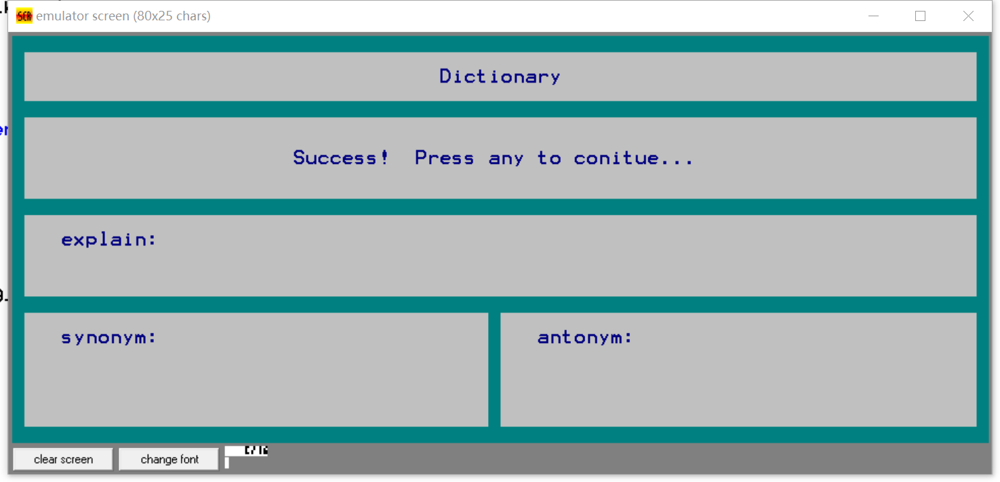

### 4. 单词修改

**修改不存在的单词**

**修改存在的单词**

### 5. 单词删除

**删除不存在的单词**

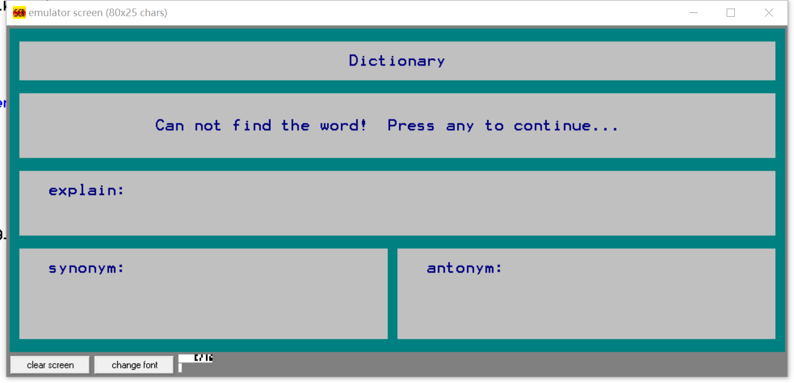

**删除存在的单词**

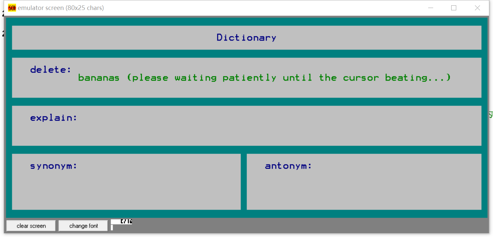
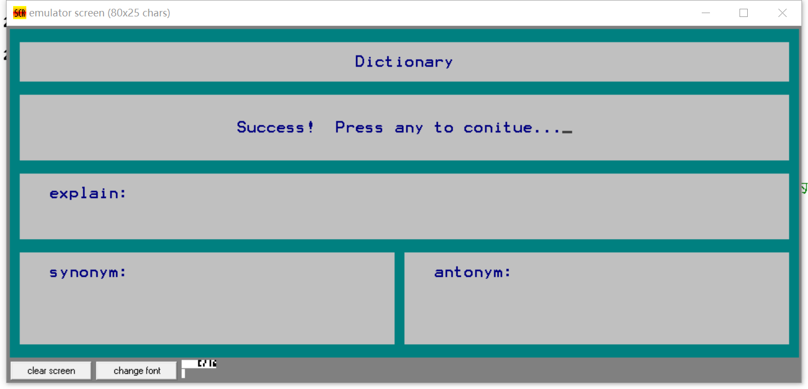

### 6. 单词导出

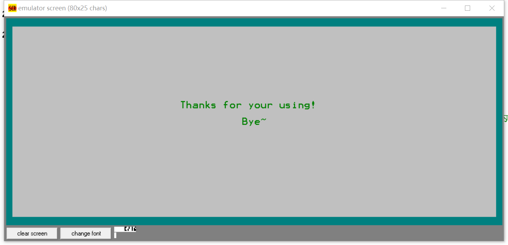

## 实现细节

### 数据结构

数据段中 `words` 模拟二维数组 `words[64][100]`，共 6400 字节：

| 字节范围 | 用途 |
|----------|------|
| 1–20 | 单词 |
| 21–60 | 英文解释 |
| 61–80 | 同义词 |
| 81–100 | 反义词 |

> 每个字段定长存储，未占满部分用空格填充。容量默认 64 个单词，可自定义调整。

### 主界面

通过键盘输入 0–4 选择功能（使用 `int 16h` 的 0 号功能，无需回车），输入其他字符会提示错误。

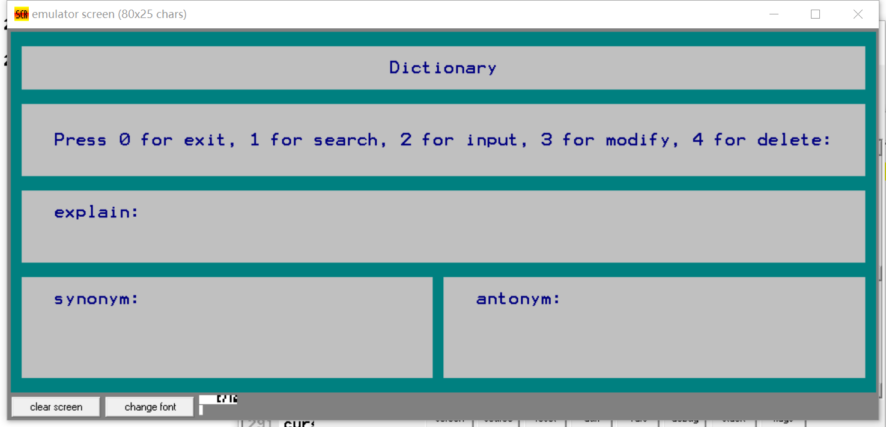

### 核心算法

- **搜索**：双重循环，外层遍历单词，内层逐字母比对。精确匹配输出详情，否则进行前缀模糊匹配。
- **插入**：按字典序定位插入位置，后续单词整体后移 100 字节。
- **修改**：定位单词后，用新数据覆盖原数据。
- **删除**：定位单词后，后续单词整体前移 100 字节。

*具体实现可查看代码中的注释。*
